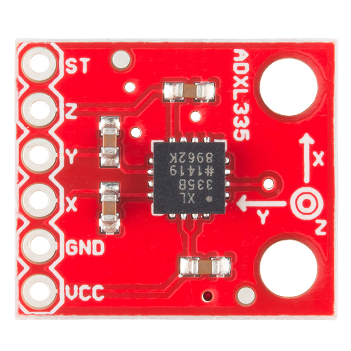
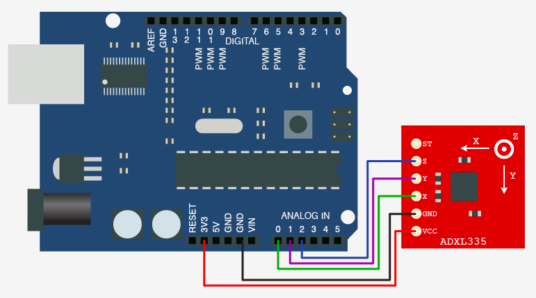
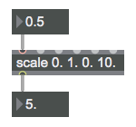

# Motion Lab Part 1

## Accelerometer: ADXL335

ADXL335 is a 3-axis accelerometer (tilt sensor). It measures the orientation of the chip.

- **X**: tilt forward/back
- **Y**: tilt left/right
- **Z**: rotation (like a compass)

### Connections

You can think of the ADXL335 as three potentiometers in one unit. You can connect Power to Power, ground to ground, and each x/y/z pin to an Analog In on your board.

| ADXL335 | Arduino (Uno or MKR1000)   |
| ------- | -------------------------- |
| Vcc     | Vcc                        |
| Gnd     | Gnd                        |
| X       | A0  (or another Analog In) |
| Y       | A1  (or another Analog In) |
| Z       | A2  (or another Analog In) |

*Here is a graph for connecting to the Uno. These same connections can be made to the MKR1000.*

### Reading the data

You can then read the data through the MKR1000 wireless receiver patch or in Maxuino.

If you connected the accelerometer's X pin to the arduino's A0 pin, you will (hopefully) see the accelerometer data appearing in your max patch in the A0 slider.

## Mapping

You will receive a lot of numbers from the sensor. So, what to do with them?

A good procedure for mapping:

- **Observe the data**

  - What kind of numbers is the sensor giving you?

- **Scale the data**:

  - You'll need to turn the sensor numbers into something musically useful.
  - Consider the aspect of sound that you want to control (frequency? amplitude? rhythm?). What kind of numbers do you want to use?  (e.g. frequency range is 20 - 20,000, although you might not want to use that whole range!)
  - The scale object in Max is especially helpful for this.

  - It lets you scale one range of data to another range. Here, a (0 to 1) range is scaled to a (0 to 10) range. So 0.5 in becomes 5 out. 

  

- **Sonify!**

  - Now that you've scaled the data your sensor data to something musically useful, hook it up to a synth like [tri~] or [cycle~] and make some noise.

