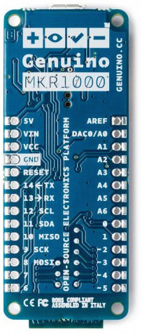

# Wireless: MKR1000

The MKR1000 is a new board that contains an on-board wifi unit. It is a pretty amazing all-in-one for wireless Arduino and Internet of Things projects.

The board is **3.3v**, which is different than the Uno (5v), so be careful. Most of your controls (pots, buttons, accelerometers) will work just fine with this board. However, any part that explicitly takes 5v as input or output should not be connected to this board without some kind of voltage regulation.

#### Folder Contents

- **Arduino sketch:** connects to Wifi and emits analog sensor values.

- **Max patch:** receives sensor values

- **Externals:** a few Max externals for network communication

  ​

### Setup

1. **Install SAMD library**

   When you plug in the board, you may be prompted by Arduino to install an update for SAMD boards. (Do it.) If you don't see that update, follow these steps to install it manually:

   - On the menu bar, go to Tools > Board > Boards Manager
   - Search for "SAMD"
   - Install the package "Arduino SAMD Boards" by Arduino
   - Restart your Arduino IDE

2. **Install Wifi101 library**

   - On the menu bar, go to Sketch > Include Library > Manage Libraries
   - Search for "Wifi101" by Arduino and install it

3. **Download the workshop folder**

### In Max

- Go to Options > File Preferences and add the workshop folder you just downloaded.
  - This ensures that Max can find the external max objects we are using for network communication.
- Open the 'mkr-receiver' maxpatch from this folder.

### In Arduino

- Go to Tools > Board and select the MKR1000.
- Open /arduino/mkr-wireless-template sketch from the workshop folder
- Replace the 3 lines at the top of the sketch with your own network information:

  - Network Name
  - Network Password
  - IP of your computer. If you're not sure how to find your IP, these steps may help. If not, ask!
- Upload to your board!
- Open the serial monitor so you can see what is happening. It may take a few seconds to start (but not more than 30 seconds).
- ​If all goes well, you will see the serial monitor print its wireless connection information, and you will see a lot of random values showing up in Max.

