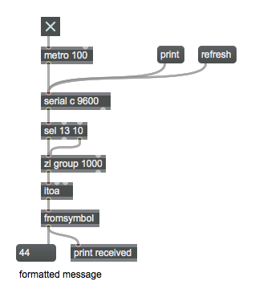

# Serial Communication   (Arduino => Max)

Serial communication between Arduino and Max means sending data through the USB cable that connects your board to your computer. It is fairly simple to code, but takes some debugging, for sure! 

**An important first step: Close your Serial Monitor. Max will not receive serial communication while the Arduino IDE Serial Monitor is open.**


#### The **Arduino** code

You can use `Serial.println()` to send data to your serial port, where it can be read by Max.

```java
void setup() {
  Serial.begin(9600) 
}

void loop() {
  int value = random(0,100)
  Serial.println(value)       // sends to Max
  delay(1000);      // wait a sec between messages
}
```


#### The **Max** code

Use the **[serial]** object to read from your serial port.

It takes several objects to convert the incoming raw serial data to legible ASCII text.

Full example:



This patch is also on Github.