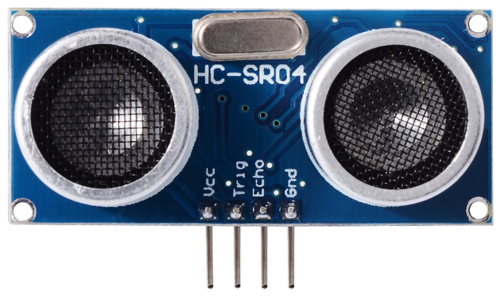

# Ultrasonic Workshop


 

## Basic Use

The following code is for the HC-SR04, which has Trig and Echo pins.

If you are using a PING sensor, you have a built-in sketch in the Examples folder of your Arduino IDE. Examples > 06.Sensors > Ping


**Connections**

| ADXL335 | Arduino (Uno or MKR1000)                 |
| ------- | ---------------------------------------- |
| Vcc     | Vcc                                      |
| Gnd     | Gnd                                      |
| Trig    | Digital Pin 9    (can be changed in the top few lines of the sketch) |
| Echo    | Digital Pin 10    (can be changed in the top few lines of the sketch) |


**Sketch**

This is a basic sketch for using an ultrasonic sensor.

You can run this as a sketch, or copy/paste pieces of it into your other sketches.

```java
/*
* Ultrasonic Sensor HC-SR04 and Arduino Tutorial
*/

// defines pins numbers
const int trigPin = 9;
const int echoPin = 10;

// defines variables
long duration;
int distance;

void setup() {
  delay(4000);
  pinMode(trigPin, OUTPUT); // Sets the trigPin as an Output
  pinMode(echoPin, INPUT); // Sets the echoPin as an Input
  Serial.begin(9600); // Starts the serial communication
}

void loop() {
  // Clears the trigPin
  digitalWrite(trigPin, LOW);
  delayMicroseconds(2);
  // Sets the trigPin on HIGH state for 10 micro seconds
  digitalWrite(trigPin, HIGH);
  delayMicroseconds(10);
  digitalWrite(trigPin, LOW);
  // Reads the echoPin, returns the sound wave travel time in microseconds
  duration = pulseIn(echoPin, HIGH);
  // Calculating the distance
  distance = duration*0.034/2;
  // Prints the distance on the Serial Monitor
  Serial.println(distance);

  delay(100);
}
```


## Smoothing the Data

Sensor data can be pretty jumpy. Try using an algorithm like this to smooth it...

```java
// this variable will keep track of the previous value
float previous = 0;

void setup() {
  Serial.begin(9600);
}

void loop() {
  // get a sensor value
  // (for testing, you can use a random number generator)
  float value = random(0,10);
  
  // then smooth it..
  // average the current sensor value with the previous sensor value
  float smoothed = (value + previous) / 2;
  // the current value is now the previous value!
  previous = value;
  Serial.println(smoothed);
  
  delay(100);
}
```


If you already have a fair amount of experience programming, you can smooth data even more, by using an array to keep track of many previous values, and averaging them all.

```java
int smoothingFactor = 5;
int history[smoothingFactor]; // create an array that will keep track of the previous 5 values

void loop() {
  // write some of your own code here to get sensor values from the arduino
  value = analogRead(0);
  // then you can smooth the value
  // first shift every item in the array to make room for the new value
  for (int i=0;i<smoothingFactor-1;i++) {
    history[i] = history[i+1];
  }
  // add the latest sensor value to the history array
  history[4] = value;

  // then average all of the values in the history array
  // by first summing them, then dividing by the number of items in the history (5)
  int sum = 0;
  for (int i=0;i<smoothingFactor;i++) {
    sum += history[i];
  }
  float smoothed = float(sum) / smoothingFactor; 
  Serial.println(smoothed);
  delay(100);
}

```


## Making Music

At this point, you can either send the data to Max (see [Serial Communication]()) or use the sensor values to make tones from your Arduino using Tone.


