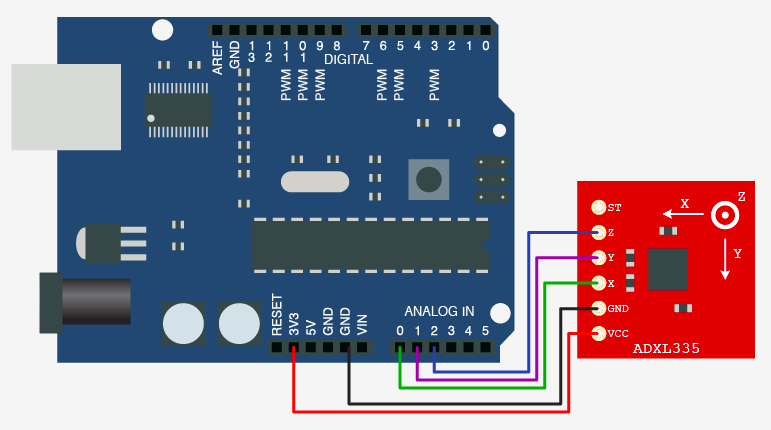

# Motion Lab

## Accelerometer: ADXL335

ADXL335 is a 3-axis accelerometer (tilt sensor). It measures the orientation of the chip.

- **X**: tilt forward/back
- **Y**: tilt left/right
- **Z**: rotation (like a compass)

#### Connections

You can think of the ADXL335 as three potentiometers in one unit. You can connect Power to Power, ground to ground, and each x/y/z pin to an Analog In on your board.

| ADXL335 | Arduino (Uno or MKR1000)   |
| ------- | -------------------------- |
| Vcc     | Vcc                        |
| Gnd     | Gnd                        |
| X       | A0  (or another Analog In) |
| Y       | A1  (or another Analog In) |
| Z       | A2  (or another Analog In) |

#### Reading the data

You can then read the data in Maxuino or through the MKR1000 max receiver patch.

## Ultrasonic Motion Sensor:

