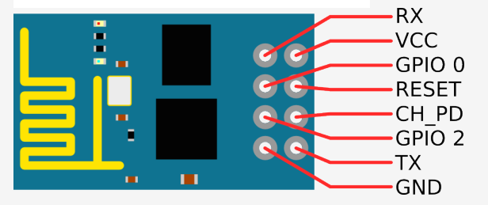

# ESP8266 Setup

## The Wiring

ESP pinout:

*Source:  [https://forum.arduino.cc/index.php?topic=283043.0](https://forum.arduino.cc/index.php?topic=283043.0)*

**Connections**:

| Arduino (Uno or Nano)                    | ESP8266 |
| ---------------------------------------- | ------- |
| RX                                       | RX      |
| TX                                       | TX      |
| Ground (or Ground of separate power supply) | Ground  |
| 3.3V from Uno (or 3.3v of separate power supply) | VCC     |
| 3.3V from Uno (or 3.3v of separate power supply) | CH_PD   |

When you plug in the 3.3v to your ESP, the LED on your ESP should light up and stay lit.

 

**Logic Level Converter**

https://learn.sparkfun.com/tutorials/using-the-logic-level-converter

 

**Test Your Connection**

In the Arduino IDE, open your Serial Monitor (Tools > Serial Monitor). 

In the top text input bar of the Serial Monitor, type `AT` and hit enter. If all is working correctly, you should see a response of `OK`. Congrats, you just sent a message to the ESP!

**If that doesn't work** — **change your baud rate**

If you did not receive an `OK` message, the first step is to tinker with your baud rate.

In the Serial Monitor, in the bottom right-hand corner, you'll see a *baud rate* dropdown menu. Try choosing one of the higher rates such as 115200.

Now repeat the steps to test your connection — type in `AT`, hit enter, and see if you receive an `OK` response.

 

## Connect to your Wireless Network

From the Serial Monitor (Tools > Serial Monitor), we can communicate directly with the ESP chip using the LUA programming language.

Type in each of the following commands in order to connect to your wifi network. After each command, hit enter and you should see a response from the chip. 

If you see a response of `ERROR`, check for any typos, check your wiring, etc.

- **Command**:  `AT` 

  - Responds: `OK`

- **Command**:  `AT+CWMODE=1` 

- **Command**:  `AT+CWLAP`    

  - LAP stands for List Access Points
  - Responds with a list of the wifi networks that the ESP sees

- **Command**:  `AT+CWJAP="yourwifinetworkname","password"`     

  - JAP stands for Join Access Point
  - Note that here you need to replace the requisite text. An example might be: `AT+CWJAP="thespoilsoftime","NiftyPassword"`

   

**Test**

To test that you are successfully connected to wifi, type `AT+CWJAP?` . You should get a response that shows your wireless connection, network name, etc.

**Something went wrong?**

You can reset your ESP device with the command `RST`, then start over from the first step.

 

## Arduino - ESP communication

My first test is always to run the BareMinimum sketch and make sure I don't see any errors.

Unfortunately, with my ESP connected, I'm seeing synchronization errors — they go away as soon as I disconnect TX and RX connections to ESP. These should be fixed with the logic level converter hooked up.

To achieve communication with the ESP, we'll use the [ESP8266 Arduino Library](https://github.com/esp8266/Arduino/tree/master/doc/esp8266wifi).

# Dev Notes

`AT+IPR=9600`  

- sets ESP baud rate to 9600. Then switch the Serial Monitor dropdown to 9600 as well.

When writing manual commands, have RX - RX and TX - TX. Then when uploading an arduino sketch, moving RX - D8 and TX - D7.

sadam.udpReceiver - http://www.sadam.hu/hu/node/1

- udpreceive requires OSC formatting

Creating a UDP connection

- `AT+CIPSTART="UDP","192.168.1.4",4445`

